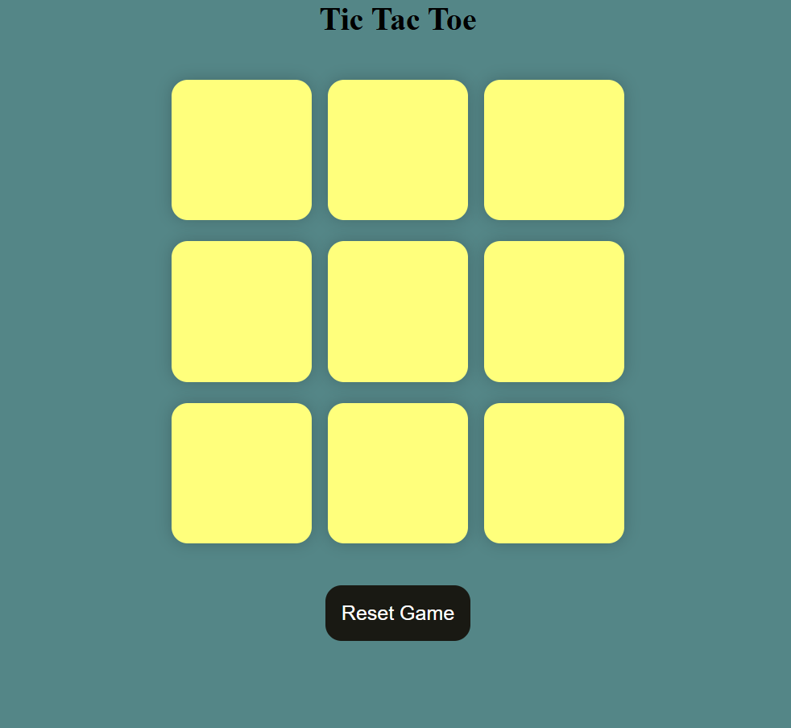

# 🎮 Tic Tac Toe Game

A simple and interactive **Tic Tac Toe** game built using **HTML, CSS, and JavaScript**.  
This project demonstrates core web development concepts such as DOM manipulation, event handling, game logic, and responsive UI design.

---

## 🖼️ Preview



> *Clean UI with responsive square buttons and smooth gameplay.*

---

## 🚀 Features

- 🎯 Two-player game (Player **O** vs Player **X**)
- 🔁 Turn-based gameplay
- 🏆 Automatic winner detection
- 🤝 Draw detection
- ♻️ **Reset Game** and **New Game** functionality
- 🎨 Clean and responsive UI
- ❌ Prevents overwriting already selected boxes

---

## 🛠️ Technologies Used

- **HTML5** – Structure of the game
- **CSS3** – Styling and layout
- **JavaScript (ES6)** – Game logic and interactivity

---

## 📂 Project Structure

```text
tic-tac-toe/
├── index.html     # Game structure
├── style.css      # Styling and layout
├── script.js      # Game logic
└── README.md      # Project documentation
```

---

## 📜 How the Game Works

- The game starts with **Player O**
- Players take turns clicking on empty boxes
- The game checks for a winning pattern after every move
- If a player wins, a message is displayed
- If all boxes are filled and no one wins, the match is declared a **draw**
- Players can:
  - Start a **New Game**
  - **Reset** the current game at any time

---

## 🧠 Winning Patterns Used

```js
const winningPatterns = [
  [0, 1, 2],
  [0, 3, 6],
  [0, 4, 8],
  [1, 4, 7],
  [2, 5, 8],
  [3, 4, 5],
  [6, 7, 8],
];
```
---

## ▶️ How to Run the Project

1. **Clone the repository:**
   ```bash
   git clone [https://github.com/susha1122/Tic-Tac-toe-Game.git](https://github.com/susha1122/Tic-Tac-toe-Game.git)

2. **Navigate to the project folder:**
   ```bash
   cd Tic-Tac-toe-Game

3. **Open index.html in your browser:**
    - Double-click the file (OR)
    - Use Live Server (recommended)

---

## 🔮 Future Improvements

- 🤖 Add single-player mode with AI
- 📱 Improve mobile responsiveness
- 🔊 Add sound effects
- 🧮 Display score tracking
- 🌙 Dark mode support

---

## 👩‍💻 Author
Susha
GitHub: @susha1122
